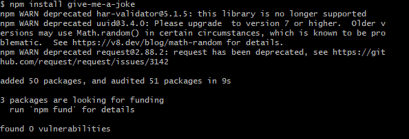
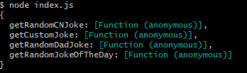
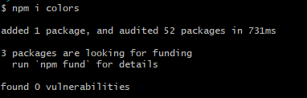
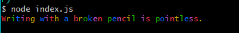

# NPM jokes and colors
practicing using NPM with random jokes and colors 

1. Create new Js file in GitBash  
  

2. Install Jokes NPM  
  

3. Check out jokes properties  
  

4. Install Colors NPM  
  

5. Enjoy random rainbow jokes  
  

